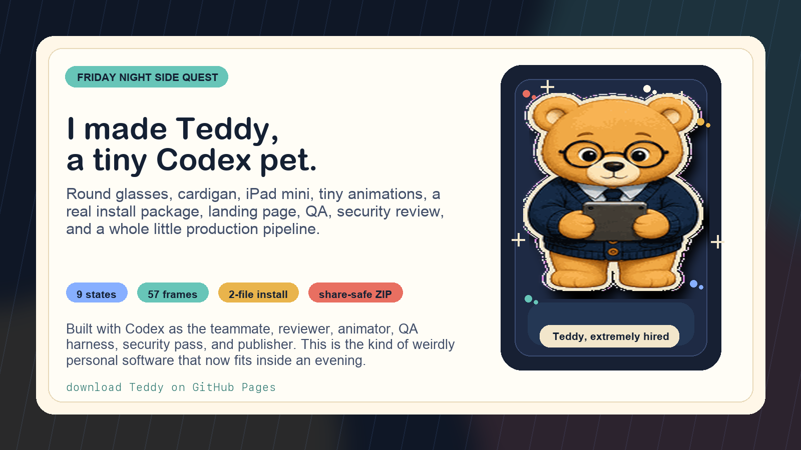
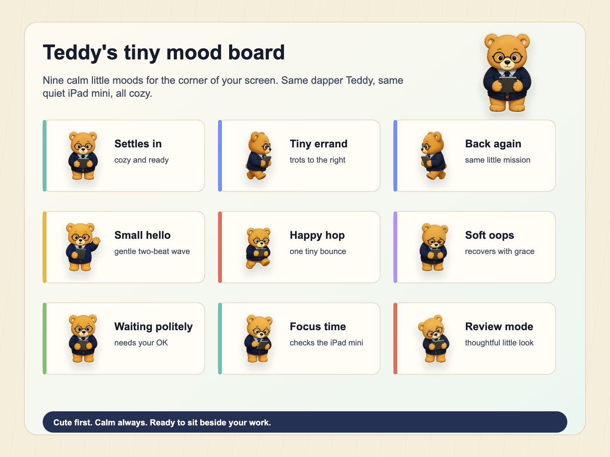
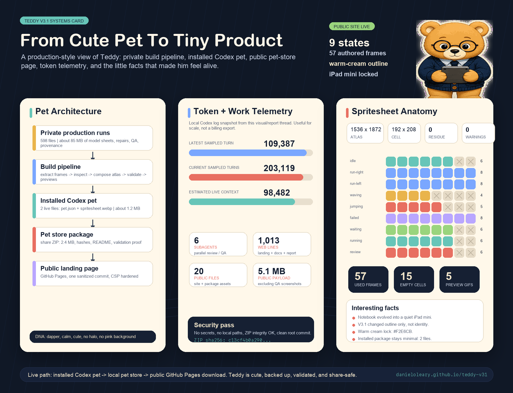

# Teddy, a Little Bear Pet for Codex

Meet Teddy, a tiny animated bear buddy for your Codex screen. Teddy is calm, dapper, and built by [Dan O'Leary](https://github.com/danieloleary), co-designed with Teddy and OpenClaw: round glasses, a navy cardigan, a tiny iPad mini, and a warm cream sticker outline.

[](https://danieloleary.github.io/teddy-v31/)

## Download

- Landing page: [danieloleary.github.io/teddy-v31](https://danieloleary.github.io/teddy-v31/)
- Friend-ready ZIP: [downloads/teddy-codex-buddy.zip](downloads/teddy-codex-buddy.zip)
- Dan's GitHub: [github.com/danieloleary](https://github.com/danieloleary)
- Built with Codex: [openai.com/codex](https://openai.com/codex/)
- Package SHA-256: `6b7a8848a2842548ff4365ef011a3b355f4be9b14740f89e4ad49b54c7594f1f`
- Spritesheet SHA-256: `320be4f11d6ce14288e2756f972f2909231032259f5c297fd35271923efc8e64`

## Install Teddy

1. Download `teddy-codex-buddy.zip`.
2. Unzip it.
3. Open the unzipped `teddy` folder.
4. Copy `pet.json` and `spritesheet.webp` into `~/.codex/pets/teddy/`.
5. Restart Codex if Teddy does not appear right away.
6. Select `Teddy` in Codex pets.

## Tell Codex To Install It

Paste this into Codex:

```text
Please install Teddy, my tiny Codex buddy, from:
https://danieloleary.github.io/teddy-v31/downloads/teddy-codex-buddy.zip

Download and unzip it, copy pet.json and spritesheet.webp into ~/.codex/pets/teddy/,
then verify the installed spritesheet hash matches the package manifest.
```

## Teddy Moves



## Repo Map

- `index.html`, `styles.css`, `script.js`: the public landing page.
- `downloads/teddy-codex-buddy.zip`: the share-safe install package.
- `assets/pet.json` and `assets/spritesheet.webp`: the two files Codex needs.
- `assets/site/`: landing-page images and README visuals.
- `assets/manifest.json` and `assets/installed-validation.json`: proof files for the curious.

## Package Contents

The ZIP includes:

- `pet.json`
- `spritesheet.webp`
- `README.md`
- `contact-sheet.png`
- `dark-before-after-spotcheck.png`
- `installed-validation.json`
- `manifest.json`

Only `pet.json` and `spritesheet.webp` are needed for installation. The rest are previews, validation proof, and hashes.

## Validation

- Atlas: `1536x1872`
- Grid: `8x9`
- Cell: `192x208`
- Format: `WEBP`
- Mode: `RGBA`
- Transparent RGB residue: `0`
- Errors: `[]`
- Warnings: `[]`

<details>
<summary>Build story visual</summary>



</details>

## Source

The full production run is retained in the author's local Teddy archive. The public package is path-sanitized and contains only install assets, previews, validation proof, and hashes.
