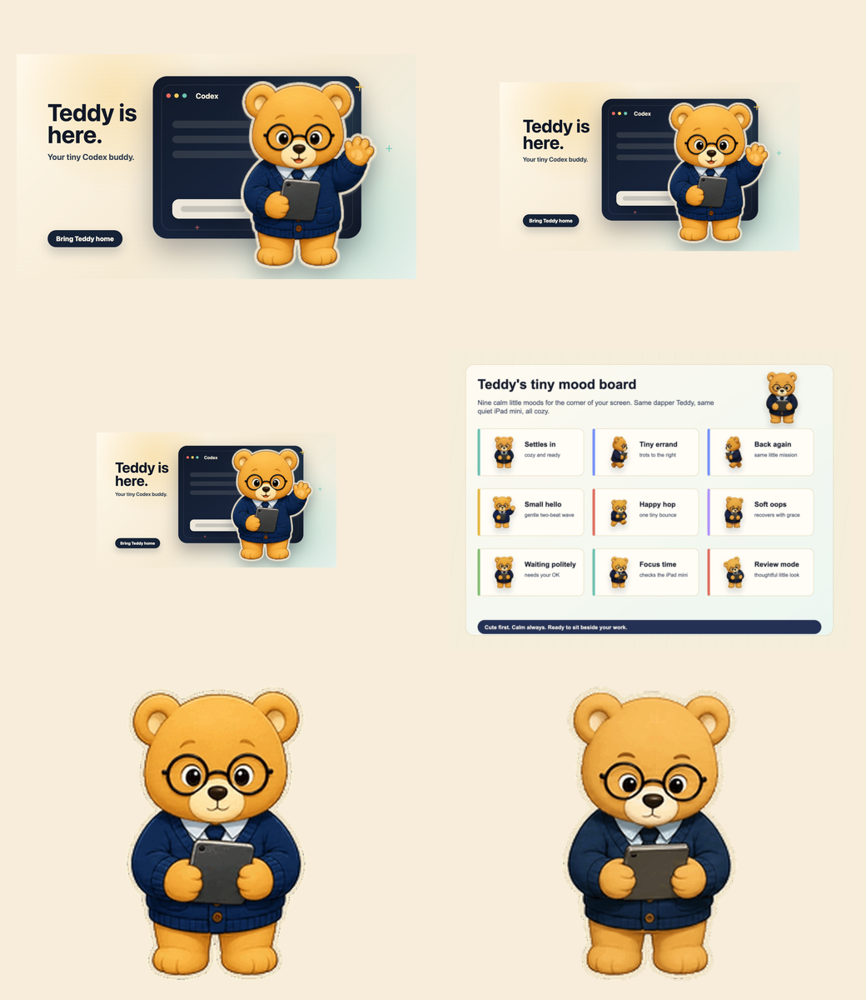

# Teddy Social Image Library

Use these files when posting Teddy on X, LinkedIn, or a launch article. Lead with Teddy, not the build story.

## Best Picks

1. `01-x-article-hero-1600x900.png`
   - Best for X Articles, link cards, LinkedIn, and the first post in a thread.
   - Alt: Teddy, a small golden bear with round glasses and a navy cardigan, waves in front of a Codex window.

2. `02-x-square-post-1200x1200.png`
   - Best when you want a simple feed image that crops safely.
   - Alt: Teddy waves in front of a Codex window on a warm cream background.

3. `03-x-portrait-post-1080x1350.png`
   - Best for taller mobile feed presence.
   - Alt: Teddy waves in front of a Codex window in a tall social post layout.

4. `04-x-thread-mood-board-1600x1200.png`
   - Best as the second image in a thread to show Teddy's moods.
   - Alt: A mood board showing Teddy in nine small animation states.

5. `05-x-gif-waving.gif`
   - Best engagement GIF.
   - Alt: Animated Teddy waves gently while holding a tiny iPad mini.

6. `06-x-gif-reviewing.gif`
   - Best builder follow-up GIF.
   - Alt: Animated Teddy studies his iPad mini with a calm, focused expression.

## Preview

## Verified

- Static images are PNG and under 5 MB.
- GIFs are under 5 MB, so they clear X mobile and web limits.
- X accepts GIF, JPEG, and PNG files for posts.
- X supports 1-4 photos per post, but only one GIF per post.
- No architecture charts, hashes, contact sheets, or validation screenshots should lead the post.
- Recommended X Article title: `Meet Teddy, a Tiny Animated Bear Pet for Codex`.

Spec reference: https://help.x.com/articles/20156423-posting-photos-on-twitter
